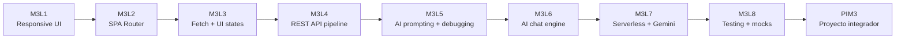
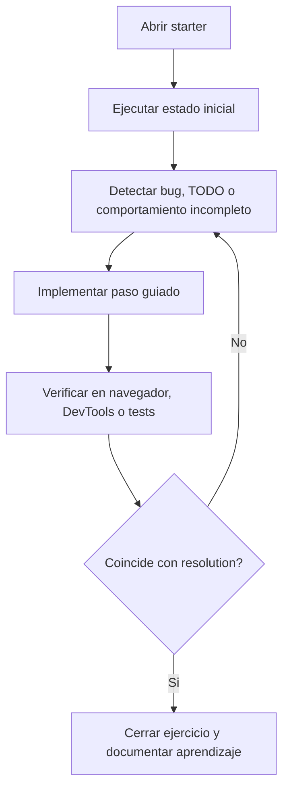
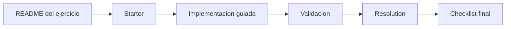

# M3 Fullstack

Repositorio de ejercicios practicos del Modulo 3. El recorrido esta pensado para trabajar frontend moderno con JavaScript vanilla, consumo de APIs, debugging, AI prompting, integracion con APIs de IA, serverless functions, testing y un proyecto integrador.

La estructura del repo separa, cuando corresponde, dos versiones por clase:

| Carpeta | Uso |
|---------|-----|
| `starter` | Punto de partida para clase. Puede tener TODOs, bugs intencionales o tests fallando a proposito. |
| `resolution` | Version final de referencia. Sirve para comparar, validar y cerrar el ejercicio. |

## Mapa del repositorio

```text
M3_Fullstack/
|-- M3L1/       # Responsive design mobile-first
|-- M3L2/       # SPA routing con History API
|-- M3L3/       # Fetch API, estados de UI y retry
|-- M3L4/       # APIs REST, transformacion de datos y render
|-- M3L5/       # AI prompting aplicado a debugging frontend
|-- M3L6/       # Arquitectura de chat engine para AI APIs
|-- M3L7/       # Serverless functions + Gemini + Vercel
|-- M3L8/       # Unit testing con Vitest y mocks
`-- PIM3/       # Proyecto integrador final
```

## Recorrido conceptual



## Como leer el repo

| Caso | Que abrir primero | Para que sirve |
|------|-------------------|----------------|
| Quiero dar la clase en vivo | `starter` | Permite construir la solucion paso a paso. |
| Quiero ver el resultado final | `resolution` | Muestra el comportamiento esperado y la arquitectura terminada. |
| Quiero entender el tema | `README.md` de cada ejercicio | Explica objetivo, archivos, flujo y errores comunes. |
| Quiero comparar avance | `starter` vs `resolution` | Permite ver que se completo y por que. |
| Quiero validar funcionamiento | Comandos de cada seccion | Levanta la app o corre tests segun el ejercicio. |

## Indice de ejercicios

| Clase | Carpeta | Tema principal | App / ejercicio | Conceptos trabajados | Como se usa |
|-------|---------|----------------|-----------------|----------------------|-------------|
| M3L1 | `M3L1` | Responsive design | Tarjeta de perfil mobile-first | HTML semantico, CSS responsive, media queries, layout adaptable | Abrir con Live Server o navegador. Comparar `index.html` y `starter.html`. |
| M3L2 | `M3L2/starter` y `M3L2/resolution` | Routing SPA | Mini SPA con Home, Chat, About y 404 | `history.pushState`, `popstate`, deep links, link interception, ES modules | Resolver desde `starter`; usar `resolution` como referencia final. |
| M3L3 | `M3L3/starter` y `M3L3/resolution` | Fetch robusto | Buscador de Pokemon | `fetch`, doble `await`, `response.ok`, estados `idle/loading/success/error`, retry | Completar TODOs del starter hasta igualar la resolution. |
| M3L4 | `M3L4/starter` y `M3L4/resolution` | REST APIs y datos | Galeria Rick & Morty | `URLSearchParams`, validacion de JSON, transformacion a ViewModel, render de grilla | Inspeccionar JSON, completar pipeline y validar UI. |
| M3L5 | `M3L5/starter` y `M3L5/resolution` | AI prompting | Chat demo con bugs intencionales | Diagnostico, prompts estructurados, evidencia en DevTools, fix minimo, verificacion | Reproducir bugs, pedir ayuda a IA con buen prompt y documentar el proceso. |
| M3L6 | `M3L6/starter` y `M3L6/resolution` | AI chat engine | Chat con mock de API de IA | Payloads, historial, normalizacion de respuestas, debounce, lock, retry 429 | Construir la arquitectura desde el starter y comparar con resolution. |
| M3L7 | `M3L7/starter` y `M3L7/resolution` | Backend serverless | Dad Joke Generator con Gemini | Vercel Functions, variables de entorno, API key server-side, `POST /api/joke` | Crear `.env`, levantar Vercel Dev y validar que la key no se expone. |
| M3L8 | `M3L8/starter` y `M3L8/resolution` | Testing | Dad Joke Generator + Vitest | Unit tests, funciones puras, `describe/it/expect`, `vi.fn`, mock de `fetch` | En starter los tests fallan a proposito; el objetivo es llevarlos a verde. |
| PI | `PIM3` | Proyecto integrador | Chat con Sherlock Holmes | Prompt de personaje, Gemini, Vercel, tests, persistencia local, UI final | Proyecto completo para entrega, demo, deploy y validacion con tests. |

## Starter vs Resolution



| Aspecto | Starter | Resolution |
|---------|---------|------------|
| Objetivo | Practicar implementacion guiada | Mostrar solucion final |
| Estado esperado | Puede estar incompleto | Debe funcionar completo |
| Bugs | Algunos son intencionales | Deben estar corregidos |
| Tests | Pueden fallar en rojo inicial | Deben pasar cuando aplica |
| Uso docente | Programar en vivo | Comparar y explicar decisiones |

## Requisitos generales

| Herramienta | Para que se usa | Ejercicios |
|-------------|-----------------|------------|
| Navegador moderno | Ejecutar HTML, CSS y JavaScript | Todos |
| VS Code + Live Server | Levantar ejercicios con ES modules | M3L1 a M3L6 |
| Node.js + npm | Instalar dependencias y correr scripts | M3L7, M3L8, PIM3 |
| Vercel CLI | Ejecutar serverless functions localmente | M3L7, M3L8, PIM3 |
| API key de Gemini | Probar integraciones reales de IA | M3L7, PIM3 |

Instalaciones utiles:

```bash
npm install -g vercel
npm install -g live-server
```

Tambien se puede usar:

```bash
npx --yes live-server
npx --yes vercel dev
```

## Como ejecutar cada tipo de ejercicio

### Ejercicios estaticos o con ES modules

Aplica principalmente a `M3L1`, `M3L2`, `M3L3`, `M3L4`, `M3L5` y `M3L6`.

```bash
cd M3L3/starter
npx --yes live-server --port=8097
```

Abrir:

```text
http://127.0.0.1:8097
```

Notas:

| Punto | Explicacion |
|-------|-------------|
| No abrir siempre con `file://` | Los proyectos con `type="module"` funcionan mejor servidos por HTTP. |
| Usar puertos distintos | Permite comparar `starter` y `resolution` al mismo tiempo. |
| Revisar DevTools | Network, Console y Responsive Mode son parte del aprendizaje. |

### Ejercicios con Vercel Functions

Aplica a `M3L7`, `M3L8` y `PIM3`.

```bash
cd M3L7/resolution
npm install
cp .env.example .env
npm run local
```

En Windows PowerShell, si `cp` no esta disponible:

```powershell
Copy-Item .env.example .env
```

Luego editar `.env` y agregar la key real:

```text
GEMINI_API_KEY=tu_api_key
```

Abrir:

```text
http://localhost:3000
```

### Ejercicios con tests

Aplica a `M3L8` y `PIM3`.

```bash
cd M3L8/resolution
npm install
npm run test:run
```

En `M3L8/starter`, los tests de `jokeUtils.test.js` estan preparados para fallar al inicio. Ese rojo inicial es parte del ejercicio.

## Uso recomendado en clase

| Momento | Accion | Evidencia esperada |
|---------|--------|--------------------|
| 1. Presentacion | Abrir README del ejercicio | Objetivo claro y archivos identificados |
| 2. Diagnostico | Levantar `starter` | Ver bug, TODO o comportamiento incompleto |
| 3. Implementacion | Resolver un archivo por vez | Cambios chicos y verificables |
| 4. Validacion | Probar en navegador, DevTools o tests | Resultado medible |
| 5. Comparacion | Abrir `resolution` | Confirmar arquitectura y decisiones |
| 6. Cierre | Completar checklist o log | Aprendizaje documentado |

## Guia rapida por ejercicio

### M3L1 - Tarjeta responsive

| Punto | Detalle |
|-------|---------|
| Tema | Mobile-first, CSS responsive, media queries |
| Entrada | `M3L1/index.html` y `M3L1/starter.html` |
| Validacion | Probar 320px, 768px y 1024px |
| Resultado | Card adaptable con layout estable en mobile, tablet y desktop |

### M3L2 - Router SPA

| Punto | Detalle |
|-------|---------|
| Tema | Navegacion sin recarga |
| Starter | `M3L2/starter` |
| Resolution | `M3L2/resolution` |
| Validacion | Clicks internos, Back/Forward, deep links y ruta 404 |
| Resultado | SPA con URL sincronizada con la vista |

### M3L3 - Fetch y estados

| Punto | Detalle |
|-------|---------|
| Tema | Fetch robusto contra una API externa |
| Starter | `M3L3/starter` |
| Resolution | `M3L3/resolution` |
| Validacion | Buscar `pikachu`, buscar inexistente, simular offline, usar retry |
| Resultado | UI con estados claros y errores controlados |

### M3L4 - REST API pipeline

| Punto | Detalle |
|-------|---------|
| Tema | Separar red, transformacion y render |
| Starter | `M3L4/starter` |
| Resolution | `M3L4/resolution` |
| Validacion | Buscar personajes, revisar cards, probar errores y responsive |
| Resultado | Galeria robusta con datos transformados antes de llegar a UI |

### M3L5 - AI prompting para debugging

| Punto | Detalle |
|-------|---------|
| Tema | Usar IA con evidencia tecnica |
| Starter | `M3L5/starter` |
| Resolution | `M3L5/resolution` |
| Validacion | Reproducir bugs, escribir prompts, aplicar fixes y documentar log |
| Resultado | Prompting profesional: contexto, objetivo, restricciones, evidencia y criterios |

### M3L6 - Chat engine para AI APIs

| Punto | Detalle |
|-------|---------|
| Tema | Arquitectura previa a una API real de IA |
| Starter | `M3L6/starter` |
| Resolution | `M3L6/resolution` |
| Validacion | Enviar mensajes, cambiar personaje, probar 429, revisar historial |
| Resultado | Pipeline de chat con payload, normalizacion, retry y control de duplicados |

### M3L7 - Serverless + Gemini

| Punto | Detalle |
|-------|---------|
| Tema | Separar frontend de backend serverless |
| Starter | `M3L7/starter` |
| Resolution | `M3L7/resolution` |
| Validacion | Generar chiste, revisar Network y confirmar que la API key no aparece |
| Resultado | Frontend llama a `/api/joke`; Gemini y la key quedan del lado servidor |

### M3L8 - Testing con Vitest

| Punto | Detalle |
|-------|---------|
| Tema | Tests unitarios y mocks |
| Starter | `M3L8/starter` |
| Resolution | `M3L8/resolution` |
| Validacion | `npm run test:run` |
| Resultado | Funciones puras testeadas y `fetch` mockeado con `vi.fn()` |

### PIM3 - Proyecto integrador

| Punto | Detalle |
|-------|---------|
| Tema | Integracion final del modulo |
| Carpeta | `PIM3` |
| App | Chat con Sherlock Holmes usando Gemini |
| Validacion | `npm run test:run`, demo local y deploy opcional |
| Resultado | Proyecto completo con UI, serverless, prompt de personaje, tests y documentacion |

## Checklist de revision del repo

| Check | Estado esperado |
|-------|-----------------|
| Estructura raiz | Carpetas `M3L1` a `M3L8` y `PIM3` en la raiz |
| Dependencias | `node_modules` no se sube al repo |
| Secretos | `.env` real no se sube; solo `.env.example` |
| Starters | Pueden incluir TODOs o fallos intencionales |
| Resolutions | Deben representar la solucion final |
| Tests | En resolution deben pasar cuando el ejercicio incluye testing |
| Documentacion | Cada ejercicio explica objetivo, archivos y forma de correr |

## Troubleshooting comun

| Problema | Causa probable | Solucion |
|----------|----------------|----------|
| El navegador bloquea modulos | Se abrio con `file://` | Levantar con `live-server` o `python -m http.server` |
| Una ruta SPA da 404 del servidor | El server no redirige a `index.html` | Usar Live Server o configurar fallback |
| `npm run local` falla | Faltan dependencias | Ejecutar `npm install` dentro de la carpeta |
| Gemini no responde | Falta `GEMINI_API_KEY` o hay rate limit | Crear `.env`, reiniciar Vercel Dev o esperar |
| Los tests del starter fallan | Puede ser intencional | Leer README del starter y completar TODOs |
| `node_modules` aparece localmente | Dependencias instaladas | Es correcto localmente; no debe subirse a Git |

## Convencion de trabajo



Regla practica:

```text
starter = lugar de trabajo
resolution = referencia de calidad
README = guia de uso y explicacion
```

## Estado esperado del repositorio

Este repositorio debe poder usarse como material de clase y como referencia posterior. La prioridad es que cada ejercicio sea entendible, reproducible y verificable:

| Criterio | Que significa |
|----------|---------------|
| Entendible | El README explica que tema se trabaja y por que. |
| Reproducible | Hay comandos claros para levantar o testear. |
| Verificable | Hay criterios observables: UI, DevTools, tests o checklist. |
| Seguro | No se suben secretos ni dependencias generadas. |
| Didactico | Los starters conservan el espacio para que el alumno construya. |
